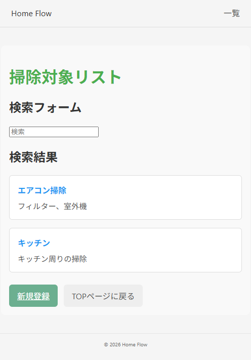

# home-flow

* React勉強を兼ねた掃除補助アプリ
  * 補充品の在庫管理や最後に掃除した日、掃除方法を管理する

## 使い方

* firebase cloud firestoreでアプリを作る
* .envに設定値を入れる
* サーバを起動する

## 素材

### アイコン

<https://icooon-mono.com/14371-%e3%83%90%e3%82%b1%e3%83%84%e3%82%a2%e3%82%a4%e3%82%b3%e3%83%b32/>